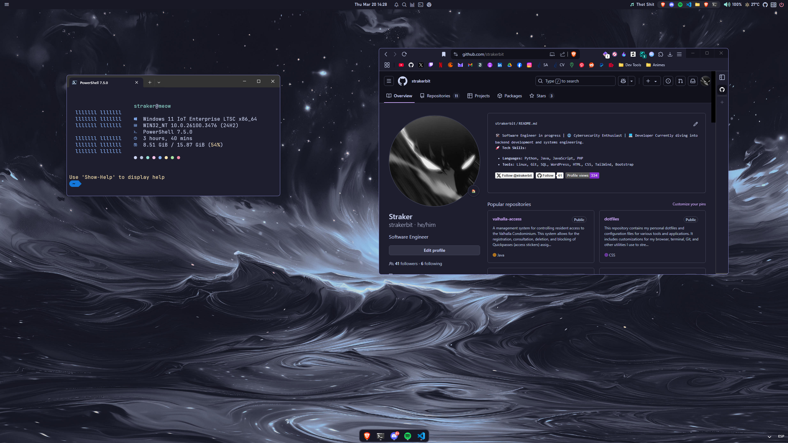
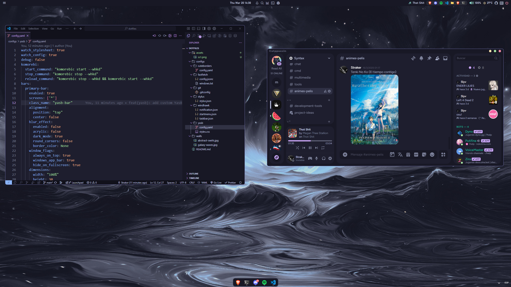
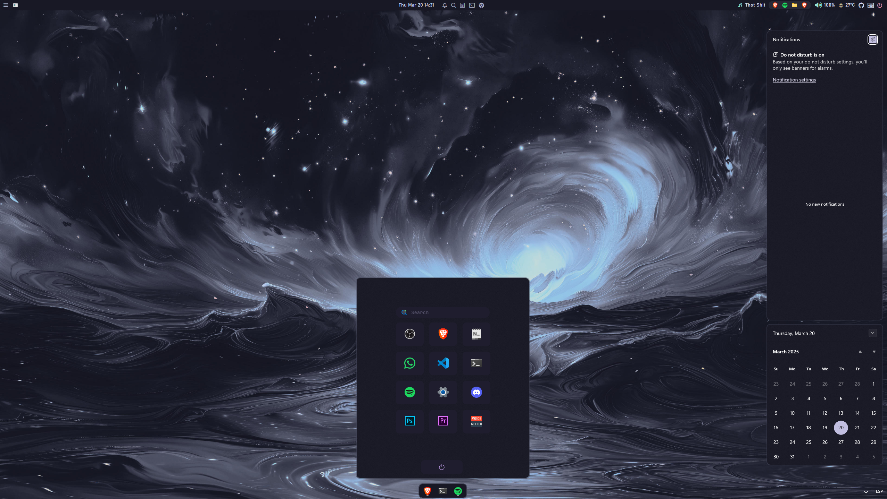

<h1 align="center"> 💫 Windows 11 Catppuccin Mocha Rice </h1>

### 🍵 My Personalized Windows Setup  

Welcome to my dotfiles repository! This repository contains my personalized configurations to enhance my Windows experience with a clean, minimal, and aesthetic look inspired by **Catppuccin Mocha**.  

---

<br/><br/>
<br/><br/>
<br/><br/>
*Screenshots showing the look of my customized Windows setup.*

---

## ✨ Features  

- **Elegant UI Customization:** Refined window borders, themes, and other tweaks.  
- **Efficient Workflow:** Tools and configurations aimed at boosting productivity.  
- **Consistency Across Environments:** Easy to replicate setup for any user.  

---

## 🛠️ Configurations  

### 🔹 UI Enhancements  
- **📌 Topbar:** [Yasb](https://github.com/amnweb/yasb) (My custom [config](configs/yasb/))  
- **🎨 Window Borders:** [Cute Borders](https://github.com/keifufu/cute-borders) (Config: [cuteborders config](configs/cuteborders/config.yaml))  
- **🖼️ Wallpapers:** A collection from various sources (View [wallpapers](walls))  
- **📂 Windhawk:** Customizations for Start Menu, Taskbar, and more ([config](configs/windhawk/))  

### 🔹 Terminal & Productivity  
- **🐱‍💻 Git:** My personal [Git config](configs/git/)  
- **⚡ Fetch:** [Fastfetch](https://github.com/fastfetch-cli/fastfetch) (Config: [fastfetch config](configs/fastfetch/))  
- **🔎 Spotlight-Like Search:** [PowerToys Run](https://github.com/microsoft/PowerToys/releases)  
- **💻 PowerShell Profile:** [Oh My Posh](https://ohmyposh.dev/) (ChrisTitusTech config)  

### 🔹 Theming & Aesthetics  
- **🟤 Brave Theme:** [Catppuccin Mocha Theme](https://chromewebstore.google.com/detail/catppuccin-chrome-theme-m/bkkmolkhemgaeaeggcmfbghljjjoofoh)  
- **🌐 Website Themes:** Custom Stylus themes ([config](configs/stylus/stylus.json))  
- **🎵 Spotify Theme:** [Spicetify](https://spicetify.app/) (Theme: `text darkthemer` + Catppuccin Mocha)  
- **🖥️ Other Apps Themes:** [Catppuccin Ports](https://catppuccin.com/ports)  

<br>

--- 

<h1 align="center">🔧 Setup Guide </h1>

> [!NOTE]  
> These configurations are **personalized**. Some settings may need to be adjusted for your preferences.  
> Feel free to explore, tweak, and adapt these configurations to fit your own workflow!  
>  
> **⚠️ Warning:** Review the files before applying them, especially on different systems.  
> If you have any questions, feel free to ask on my [Reddit post](https://www.reddit.com/r/desktops/comments/1jfz8rv/simple_windows_11_catppuccin_mocha_rice/?utm_source=share&utm_medium=web3x&utm_name=web3xcss&utm_term=1&utm_content=share_button).  

## 1️⃣ Install PowerShell 7 & Windows Terminal
Both tools are essential for this setup. Install them via the Microsoft Store:
- [PowerShell 7](https://apps.microsoft.com/detail/9mz1snwt0n5d?hl=es-es&gl=ES)
- [Windows Terminal](https://apps.microsoft.com/detail/9n0dx20hk701?hl=es-es&gl=ES) *(Pre-installed in most Windows 11 versions, but not in Windows 11 IoT Enterprise LTSC)*

## 2️⃣ Install PowerToys & Everything Search
PowerToys enhances the system, and **PowerToys Run** is a key feature:
- Install PowerToys: [Download](https://github.com/microsoft/PowerToys/releases)
- Install [Everything Search](https://www.voidtools.com/es-es/)
- Install [Everything PowerToys Plugin](https://github.com/lin-ycv/EverythingPowerToys/releases/)

## 3️⃣ Install Yasb (Yet Another Status Bar)
- Install Yasb
- Replace the default configuration with my [config](configs/yasb/):
  ```plaintext
  %USERPROFILE%\.config\yasb\config.yaml
  %USERPROFILE%\.config\yasb\styles.css
  ```
Tip: *Press the Windows key + R and paste the path to go faster*.
## 4️⃣ Install Cute Borders
Adds custom-colored borders to windows:

- Install [Cute Borders](https://github.com/keifufu/cute-borders)
- Replace the default config with my [cuteborders config](configs/cuteborders/config.yaml)
  ```
  %USERPROFILE%\.cuteborders\config.yaml
  ```
  Tip: *Press the Windows key + R and paste the path to go faster*.
## 5️⃣ Install Windhawk for UI Tweaks
Install [Windhawk](https://windhawk.net/)
- Add mods like:
  - Notification Center Styler
  - Start Menu Styler
  - Taskbar Styler
- Configure each mod under the "Advanced" tab using my settings from [windhawk configs](configs/windhawk/)


## 6️⃣ Customize PowerShell with Oh My Posh
- Use Oh My Posh with Chris Titus Tech’s profile:
    ```bash
    https://github.com/ChrisTitusTech/powershell-profile
    ```
- Follow his installation guide.

## 7️⃣ Install & Configure Fastfetch
- Install [Fastfetch](https://github.com/fastfetch-cli/fastfetch)
- Generate a config file:
    ```powershell
    fastfetch --gen-config
    ```
- Locate the config:
    ```plaintext
    %USERPROFILE%\.config\fastfetch\ OR C:\ProgramData\fastfetch\
    ```
    Tip: *Press the Windows key + R and paste the path to go faster*.
    
- Replace it with my custom config from [configs/fastfetch/](configs/fastfetch/)
- Run Fastfetch by typing:
    ```powershell
    fastfetch
    ```
## 8️⃣ Apply Catppuccin Mocha Theme
- Windows Terminal: Follow this guide
- VS Code:
  - Install [Catppuccin Theme](https://marketplace.visualstudio.com/items?itemName=Catppuccin.catppuccin-vsc-pack)
  - Install [Catppuccin Icons](https://marketplace.visualstudio.com/items?itemName=Catppuccin.catppuccin-vsc-icons)
- Brave/Chrome: Install [Catppuccin Mocha Theme](https://chromewebstore.google.com/detail/catppuccin-chrome-theme-m/bkkmolkhemgaeaeggcmfbghljjjoofoh)
- [Stylus](https://chromewebstore.google.com/detail/stylus/clngdbkpkpeebahjckkjfobafhncgmne) (Website Theming):
  - Import config from [configs/stylus/stylus.json](configs/stylus/stylus.json)
  - Explore more themes: [Catppuccin Userstyles](https://catppuccin-userstyles-customizer.uncenter.dev/)
  
## 9️⃣ Customize Spotify with Spicetify
- Install [Spicetify](https://spicetify.app/docs/getting-started) (⚠️ **Use the browser-downloaded version of Spotify, NOT the Microsoft Store version**)
- Run installation command:
    ```powershell
    iwr -useb https://raw.githubusercontent.com/spicetify/cli/main/install.ps1 | iex
    ```
- Be sure to enable the marketplace through the installation processes and then install:
  - Theme: `text darkthemer`
  - Variant: `Catppuccin Mocha`
  
## 🔟 Apply Catppuccin Mocha on Discord
- Install [Vencord](https://vencord.dev/)
- In Discord settings, go to **Vencord > Themes**
- Add this Online Theme:
    ```bash
    https://raw.githubusercontent.com/refact0r/midnight-discord/refs/heads/master/flavors/midnight-catppuccin-mocha.theme.css
    ```


## 🎉 Credits</h2>

Big **thanks** to everyone at [**r/desktops**](https://www.reddit.com/r/desktops) for inspiring me to make this!

I wanna point out some resources and people that helped me the most with the setup:

- **[ashish0kumar](https://github.com/ashish0kumar/windots)** for being my main reference in creating my rice 🙏
- **[elrondforwin](https://github.com/elrondforwin/dotfiles)** for assisting me with my setup process 🛠️

## 📜 License
Feel free to use and modify these dotfiles to suit your needs.
