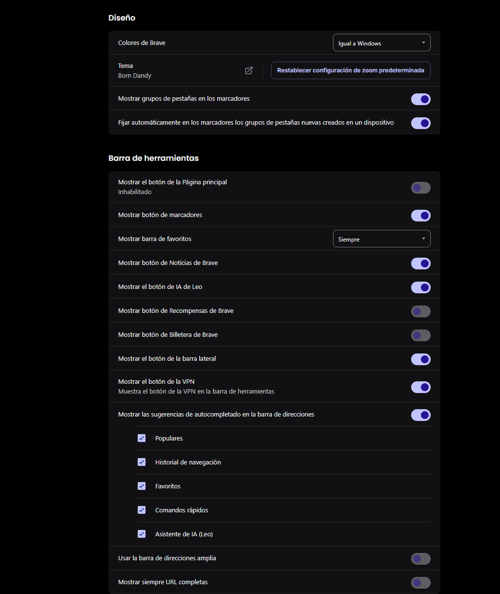
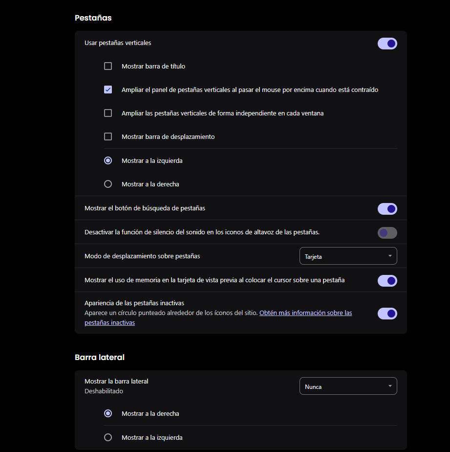

# Brave Browser Configuration

This folder contains my custom Brave browser setup, including the theme, extensions, and manual appearance adjustments. Since Brave doesn't offer an export feature for configurations, I've shared my customizations here using screenshots.

## Theme Installation

1. Install the **Born Dandy** theme from the Chrome Web Store:
   [Born Dandy Theme](https://chromewebstore.google.com/detail/born-dandy/cdcjeiepcofnpkpkmoedahdjcliodbpn)

   This theme gives the browser a sleek, dark aesthetic with a personalized touch.

## Appearance Customizations

Here are the key manual adjustments I've made to Brave’s appearance:

### 1. **Toolbar Configuration**  
   I’ve customized the toolbar to suit my workflow and make navigation easier.  
   

### 2. **Vertical Tabs**  
   I prefer having my tabs displayed vertically for better organization and easier navigation. Here’s how I configured it:  
   

## Pinned Sites on New Tab Page

In addition to the bookmark bar, Brave allows pinning websites directly on the new tab page. These pinned sites function similarly to the bookmark bar but are visually organized on the main page:  

## Extensions Installed

These are the extensions I use to enhance my browsing experience:

- **Pop-up Blocker for Chrome™ - Poper Blocker**:  
   Block annoying pop-ups and ads on websites.  
   [Poper Blocker](https://chromewebstore.google.com/detail/pop-up-blocker-for-chrome/bkkbcggnhapdmkeljlodobbkopceiche)

- **SquareX: Be Secure, Anonymous, Private Online**:  
   Protect your privacy and secure your browsing experience.  
   [SquareX](https://chromewebstore.google.com/detail/squarex-be-secure-anonymo/kapjaoifikajdcdehfdlmojlepfpkpoe)

- **Proton Pass: Free Password Manager**:  
   A secure password manager to manage and generate strong passwords.  
   [Proton Pass](https://chromewebstore.google.com/detail/proton-pass-free-password/ghmbeldphafepmbegfdlkpapadhbakde)

## Notes

- The theme and appearance customizations are tailored to my preferences, but you can easily adjust them to fit your needs.
- Feel free to experiment with the settings to see what works best for your browsing experience!
